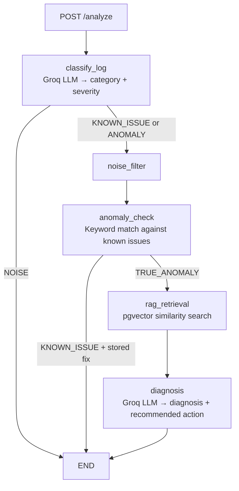

# Router Log Diagnosis Agent

An agentic pipeline that ingests raw router logs, filters noise, classifies severity, detects known vs. anomalous issues, retrieves relevant manual context via RAG, and generates an engineer-readable diagnosis with a recommended action.

Built with **FastAPI**, **LangGraph**, **Groq (llama-3.1-8b-instant)**, **sentence-transformers**, and **PostgreSQL/pgvector**.

---

## How it works



Three paths through the graph:

- **Noise** — classified by Groq, then discarded before anomaly check / RAG / diagnosis
- **Known issue** — matched against a local dictionary, returns a stored fix (skips RAG + diagnosis LLM)
- **True anomaly** — retrieves relevant manual context via pgvector, then generates a diagnosis with Groq

---

## Run locally

**Prerequisites:** Docker + Docker Compose

```bash
# 1. Set up environment
cp .env.example .env
# Add your GROQ_API_KEY to .env

# 2. Start app + Postgres (first build may take 10–15 min)
make run
# Runs in foreground; use `docker compose up --build -d` for background

# 3. Ingest router manual docs into pgvector (first time only)
make ingest

# 4. Verify
curl http://localhost:8000/health
# Interactive API docs: http://localhost:8000/docs
```

---

## Example requests

**True anomaly — full RAG + diagnosis path:**

```bash
curl -X POST http://localhost:8000/analyze \
  -H "Content-Type: application/json" \
  -d '{
    "device_id": "RTR-X99",
    "log": "Interface eth0 timeout persisting for 8 minutes, retry count exceeded"
  }'
```

**Known issue — keyword match returns stored fix (skips RAG + diagnosis LLM):**

```bash
curl -X POST http://localhost:8000/analyze \
  -H "Content-Type: application/json" \
  -d '{
    "device_id": "RTR-A12",
    "log": "BGP neighbor 10.0.0.1 down, hold timer expired"
  }'
```

**Noise — filtered immediately:**

```bash
curl -X POST http://localhost:8000/analyze \
  -H "Content-Type: application/json" \
  -d '{
    "device_id": "RTR-B04",
    "log": "Heartbeat OK"
  }'
```

**Example response (true anomaly):**

```json
{
  "device_id": "RTR-X99",
  "category": "ANOMALY",
  "severity": "CRITICAL",
  "anomaly_status": "TRUE_ANOMALY",
  "known_fix": null,
  "rag_context": [
    "[Router Manual p.45] If eth0 interface timeout persists for more than 5 minutes, verify ISP gateway connectivity using ping."
  ],
  "diagnosis": "High probability of upstream ISP outage based on timeout duration and retry exhaustion.",
  "recommended_action": "Ping ISP gateway IP and check upstream provider status page."
}
```

---

## API reference

| Endpoint               | Description                                                    |
| ---------------------- | -------------------------------------------------------------- |
| `POST /analyze`        | Run a log through the full agent pipeline                      |
| `GET /health`          | Service health check                                           |
| `GET /logs`            | Last 20 analysis results (in-memory)                           |
| `GET /dashboard/stats` | Aggregate counts: noise filtered, known issues, true anomalies |

---

## Makefile

| Command       | Description                                |
| ------------- | ------------------------------------------ |
| `make run`    | Build and start app + Postgres             |
| `make ingest` | Load `data/router_docs.json` into pgvector |
| `make test`   | Placeholder for future tests               |

---

## Stack

| Layer               | Technology                               |
| ------------------- | ---------------------------------------- |
| API                 | FastAPI                                  |
| Agent orchestration | LangGraph                                |
| LLM                 | Groq (llama-3.1-8b-instant)              |
| Embeddings          | sentence-transformers (all-MiniLM-L6-v2) |
| Vector search       | PostgreSQL + pgvector                    |
| Containerization    | Docker + Docker Compose                  |
