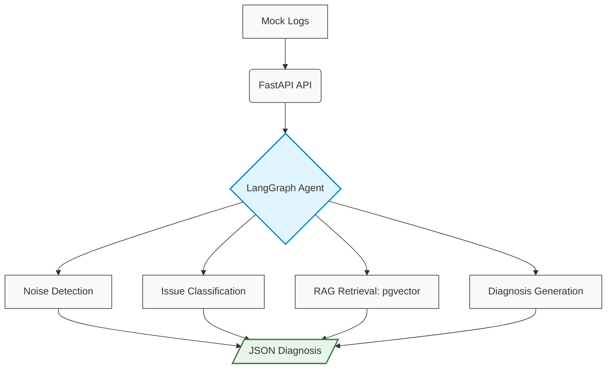

# Log Diagnosis Agent

## Problem
Routers and network devices generate thousands of logs daily. Most are noise.
Finding real failures requires manually searching documentation, cross-referencing
error codes, and deciding whether an issue is known or anomalous. That process
is slow and doesn't scale.

## Solution
An agentic AI pipeline that ingests raw logs, filters noise before any LLM call,
classifies issues, retrieves relevant context from documentation, and returns a
structured diagnosis engineers can act on.

## Architecture



## Stack
Python, FastAPI, LangGraph, HuggingFace Transformers, PostgreSQL, pgvector,
Docker, OpenAI API

## Sample Output
```json
{
  "device_id": "RTR-X99",
  "severity": "Critical",
  "error": "Connection Timeout on eth0",
  "anomaly_status": "True Anomaly",
  "diagnosis": "High probability of ISP outage based on symptom cluster.",
  "context": "Manual Pg 45: If error persists > 5 mins, check ISP gateway.",
  "recommended_action": "Ping ISP Gateway IP"
}
```
